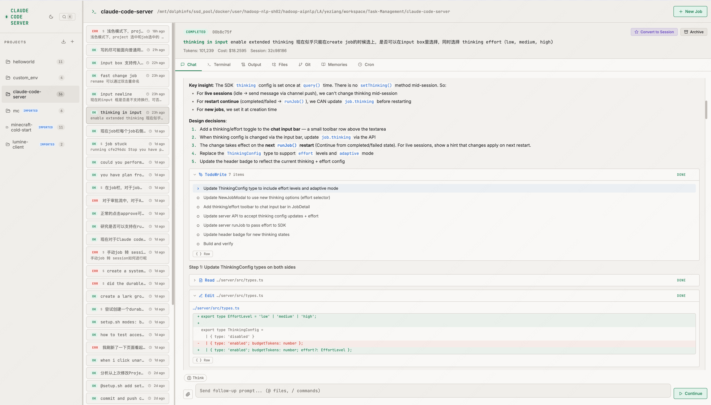

# Claude Code Server

A web-based UI for running [Claude Code](https://docs.anthropic.com/en/docs/claude-code) as a persistent headless server. Submit prompts, manage projects, stream real-time output, and interact with Claude's tools — all from your browser.

<p align="center">
  
  
  
</p>




## Why?

Claude Code's CLI is powerful but tied to a single terminal session. Claude Code Server turns it into a **multi-project, multi-job web service** with:

- A persistent web UI you can access from any browser
- Multiple concurrent Claude sessions running in parallel
- Real-time streaming of Claude's reasoning, tool calls, and results
- Interactive approval system for human-in-the-loop workflows
- Session persistence — resume conversations even after server restarts
- An embedded terminal, file browser, git panel, and more

---

## Quick Start

### One-line Setup

```bash
git clone https://github.com/your-org/claude-code-server.git
cd claude-code-server
./setup.sh
```

The setup script will:
1. Check that Node.js 18+ is installed
2. Prompt for your Anthropic API key (optionally saves to `.env`)
3. Install all dependencies
4. Start the development server

Then open **http://localhost:5173** in your browser.

### Manual Setup

```bash
# Install dependencies
cd server && npm install && cd ..
cd client && npm install && cd ..
npm install

# Set your API key
export ANTHROPIC_API_KEY=sk-ant-...

# Start development mode (HMR)
npm run dev
# Server: http://localhost:3001
# Client: http://localhost:5173  <-- open this
```

> **Need a custom API endpoint?** Set `ANTHROPIC_BASE_URL` to your proxy or gateway URL.

### Production Mode

```bash
./setup.sh --prod       # Build client + start PM2 daemon
# or
./setup.sh --prod --fg  # Build client + run in foreground (no PM2)
```

Production serves everything from a single port (`http://localhost:3001`).

See **[docs/setup.md](docs/setup.md)** for detailed installation and configuration options.
See **[docs/deployment.md](docs/deployment.md)** for production deployment, PM2, reverse proxy, and Docker.

---

## Features

### Core

| Feature | Description |
|---------|-------------|
| **Project Workspaces** | Each project gets its own working directory. Claude reads, writes, and executes code scoped to that project. |
| **Job Submission** | Send prompts with optional image attachments. Claude executes with full tool access (Bash, Read, Write, Edit, Grep, Glob, WebSearch, etc.). |
| **Real-time Streaming** | WebSocket-powered live output — watch Claude think, call tools, and produce results as they happen. |
| **Persistent Sessions** | Jobs can run as long-lived sessions. Resume conversations, send follow-ups, or fork from any point in the chat history. |
| **Interactive Approvals** | When Claude asks a question or proposes a plan, you review and respond directly in the UI. |

### UI Panels

| Panel | Description |
|-------|-------------|
| **Chat View** | Rich chat interface with per-tool rendering, syntax-highlighted diffs, thinking blocks, and subagent nesting. |
| **Terminal** | Embedded xterm.js terminal connected to your project directory via WebSocket PTY. |
| **File Browser** | Browse project files with fuzzy search across names and content. |
| **Git Panel** | View diffs, stage/unstage files, commit, push, and pull — with "touched by this job" indicators. |
| **Memories** | View and edit Claude's memory files (CLAUDE.md hierarchy) directly. |
| **Cron Tasks** | See all scheduled tasks Claude has created (durable and session-scoped). |

### Advanced

| Feature | Description |
|---------|-------------|
| **Session Mode** | Keep a Claude session alive indefinitely for ongoing work. Toggle between one-shot jobs and persistent sessions. |
| **Fork & Edit** | Branch conversations from any assistant turn, or edit and resend any of your messages. |
| **Extended Thinking** | Configure Claude's thinking budget and effort level (low/medium/high/xhigh/max) per job. |
| **Image Attachments** | Drag-and-drop, paste, or browse to attach images to your prompts. |
| **Import Local Sessions** | Discover and import past Claude Code CLI sessions from `~/.claude/projects/`. |
| **Command Palette** | `Cmd+K` to fuzzy-search across all jobs by name, prompt, or chat content. |
| **Slash Commands** | Type `/` for Claude Code commands (`/compact`, `/model`, `/memory`, etc.) or `@` for file path autocomplete. |
| **Project Archiving** | Archive projects and jobs to keep your workspace tidy. |

See **[docs/usage.md](docs/usage.md)** for a detailed walkthrough of every feature.

### Session Lifecycle Notes

The current implementation uses three different concepts that are easy to mix up:

- `status` = runtime state: `queued` / `running` / `idle` / `completed` / `failed` / `archived`
- `mode` = retention policy for the next turn: `job` or `session`
- `sessionId` = whether Claude SDK gave us a resumable session handle

Current behavior:

- A normal `job` enters `idle` after a successful turn, starts a 5 minute grace timer, then auto-completes.
- A `session` enters `idle` after a successful turn and stays there until the user closes it.
- `Pin as Session` on an already-`idle` job is a true in-place conversion: it clears the grace timer and keeps the live channel open.
- `Resume as Session` on a `completed` or `failed` job with `sessionId` now re-attaches the resumable SDK session immediately, so the job becomes a live `idle` session again.
- A finished job without `sessionId` can still accept a follow-up, but that follow-up starts a fresh Claude run on the same job record instead of resuming prior conversation context.

Why some completed/failed jobs cannot be resumed as a live session:

- The job failed before the SDK emitted its initial `session_id`
- The job was imported or created from legacy data without a stored `sessionId`
- The process/session was lost before a resumable session was captured

UI rules:

- `Pin as Session` is only for a live `idle` one-shot job.
- `Resume as Session` is only for a finished job with a resumable `sessionId`.
- Finished jobs without `sessionId` show a warning that follow-up input will start a new run without prior conversation context.
- `idle` / `Session Active` is only shown after the server has re-established a real live channel.

---

## Architecture

```
Browser (React + TypeScript)
┌─────────────┬───────────────┬──────────────────────────┐
│   Sidebar   │   Job List    │  Job Detail / Terminal   │
│  (Projects) │               │  Files / Git / Memories  │
└─────────────┴───────┬───────┴──────────────────────────┘
                      │ REST API + WebSocket
┌─────────────────────┼─────────────────────────────────────┐
│  Express Server     │                                     │
│  ┌──────────┐  ┌────┴─────┐  ┌──────────────────────┐    │
│  │ REST API │  │ WS Broker│  │ Claude Agent SDK      │    │
│  │ Projects │  │ (logs,   │  │ @anthropic-ai/        │    │
│  │ Jobs     │  │ approvals│  │ claude-agent-sdk      │    │
│  │ Files    │  │ import)  │  │                       │    │
│  │ Git      │  │          │  │ Tools: Bash, Read,    │    │
│  │ Memories │  │ Terminal │  │ Write, Edit, Grep,    │    │
│  └──────────┘  │ (PTY)   │  │ Glob, WebSearch, ...  │    │
│                └─────────┘  └───────────┬────────────┘    │
│                                         │                 │
│                              ┌──────────▼──────────┐      │
│                              │  projects/<name>/   │      │
│                              │  (working dirs)     │      │
│                              └─────────────────────┘      │
└───────────────────────────────────────────────────────────┘
```

**Tech Stack:**
- **Server**: Node.js, Express, WebSocket (`ws`), `node-pty`, `@anthropic-ai/claude-agent-sdk`
- **Client**: React 18, TypeScript, Vite, xterm.js, Lucide icons
- **Process Manager**: PM2 (production)
- **State**: JSON file persistence (`projects/.state.json`)

---

## Configuration

| Environment Variable | Default | Description |
|---------------------|---------|-------------|
| `ANTHROPIC_API_KEY` | *(required)* | Your Anthropic API key |
| `ANTHROPIC_BASE_URL` | `https://api.anthropic.com` | Custom API endpoint (proxy, gateway) |
| `CLAUDE_CODE_SERVER_MODELS` | *(Claude Code aliases + SDK list)* | Optional comma- or newline-separated model list shown in model pickers. Use `model-name \| Haiku`, `model-name \| Sonnet`, or `model-name \| Opus` to map common labels; plain entries are shown as additional models. |
| `PORT` | `3001` | Server port |
| `PROJECTS_ROOT` | `./projects` | Root directory for project workspaces |

All variables can be set in a `.env` file in the project root. The web app also has a Settings button in the lower-left sidebar for editing the API key, base URL, Haiku/Sonnet/Opus model mappings, and extra model names. Saved settings update `.env` and apply to new jobs and sessions; already-running sessions keep their current SDK process settings.

---

## Documentation

| Document | Description |
|----------|-------------|
| **[docs/setup.md](docs/setup.md)** | Detailed installation, prerequisites, configuration |
| **[docs/usage.md](docs/usage.md)** | Feature walkthrough with screenshots and examples |
| **[docs/deployment.md](docs/deployment.md)** | Production deployment, PM2, reverse proxy, Docker |
| **[docs/api.md](docs/api.md)** | REST API and WebSocket reference for developers |

---

## Project Structure

```
claude-code-server/
├── setup.sh                   # One-click install & launch
├── ecosystem.config.cjs       # PM2 production config
├── package.json               # Root scripts (dev, start, stop)
├── .env                       # API key (create this)
├── projects/                  # Runtime data
│   ├── .state.json            #   Persisted state (projects + jobs)
│   └── <ProjectName>/         #   Per-project working directories
├── server/
│   └── src/
│       ├── index.ts           # Express server, WebSocket, job runner
│       ├── types.ts           # Shared TypeScript types
│       └── claude-importer.ts # Local session discovery & import
└── client/
    └── src/
        ├── App.tsx            # Root layout, panels, command palette
        ├── components/        # UI components
        ├── hooks/             # State management, API client, autocomplete
        ├── styles/global.css  # All styles (dark theme)
        └── types/index.ts     # Client-side type definitions
```

---

## npm Scripts

| Command | Description |
|---------|-------------|
| `npm run dev` | Start dev server with HMR (client: 5173, server: 3001) |
| `npm start` | Build client + start production via PM2 |
| `npm stop` | Stop PM2 daemon |
| `npm restart` | Rebuild client + restart PM2 |
| `npm run logs` | View PM2 live logs |
| `npm run status` | Check PM2 process status |
| `npm run build:client` | Build client only (outputs to `client/dist/`) |

---

## License

MIT
